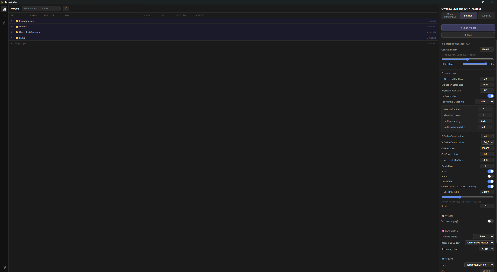
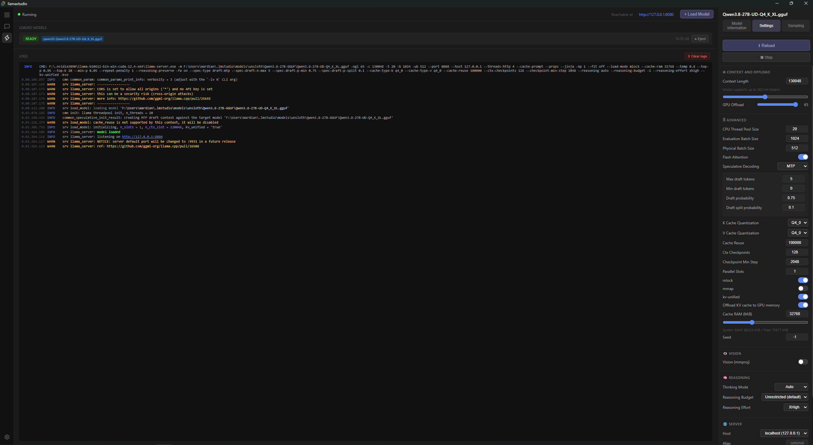
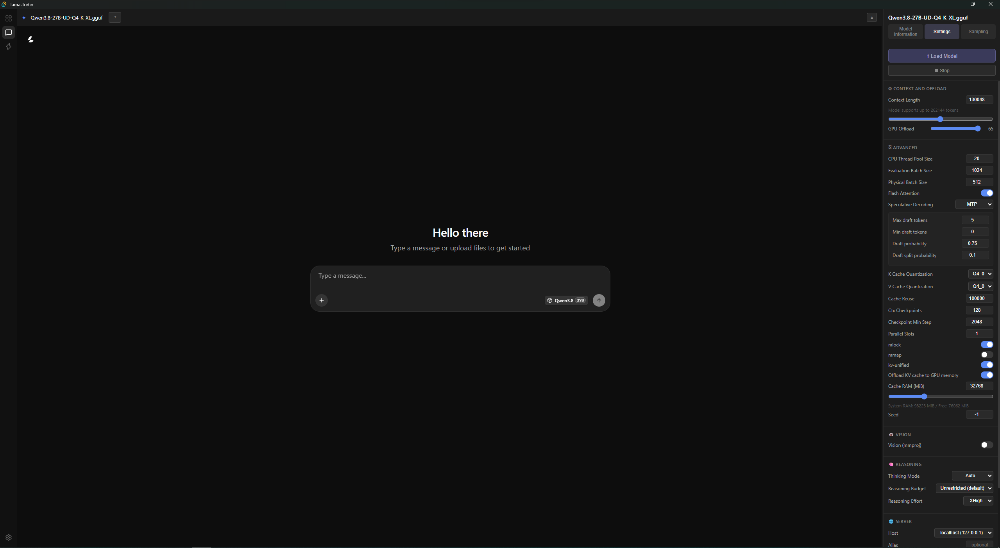

# LlamaStudio

> **⚠️ Disclaimer** — All code in this project was generated with AI assistance using Claude Sonnet 4.6 (medium) and Qwen3.8-27B-UD-Q4_K_XL (Unsloth version). It may contain errors or not work perfectly. This is a personal project by someone who does not know programming.

A desktop app for managing and running local LLMs (GGUF) with a built-in `llama-server` (llama.cpp) backend.

Entirely inspired by [LM Studio](https://lmstudio.ai/) — with modifications that fit my workflow better and weren't possible to make in LM Studio.

| Models | Developer | Chat |
| --- | --- | --- |
|  |  |  |

## Features

- **Model library** — scans a folder of `.gguf` models (publisher/family layout) and parses GGUF metadata directly (architecture, parameter count, max context length)
- **Organization** — search, groups, pinning, and drag & drop reordering
- **One-click server launch** — spawns `llama-server` with rich options: GPU offload, context length, eval/physical batches, flash attention, speculative decoding (MTP / draft model), sampling parameters, KV cache quantization, KV unified/offload, cache RAM, load mode (mmap/mlock), reasoning budget & effort, seed, model alias, sleep-when-idle
- **Live log console** — streams server output with log levels, in real time
- **Built-in chat** — embeds the llama-server web UI in-app, no extra frontend needed
- **Per-model configurations** — settings are saved per model, with sampling options (temperature, top-p, top-k, min-p, repeat penalty)
- **OpenAI-compatible server** — endpoint info and API usage hints in the UI
- **System tray** — minimize-to-tray option and window position/size persistence

## Tech Stack

- [Tauri 2](https://tauri.app/) (Rust backend)
- Vue 3 + TypeScript
- Vite
- [tauri-plugin-store](https://v2.tauri.app/plugin/store/), tauri-plugin-dialog, tauri-plugin-opener, tauri-plugin-shell

## Getting Started

### Prerequisites

- Rust (stable) + platform build tools — on Windows: Visual Studio Build Tools with the C++ workload. See [Tauri prerequisites](https://tauri.app/start/prerequisites/) for your OS
- Node.js 20+ (LTS)
- [pnpm](https://pnpm.io/) 9+
- WebView2 Runtime (Windows; preinstalled on Windows 10/11)
- A `llama-server` build from [llama.cpp](https://github.com/ggml-org/llama.cpp) — not included in the repo, path configurable in Settings. **Tested with build `b10612` (win-cuda-12.4-x64)** — other versions use different CLI flags and may not work correctly

### Setup

```bash
pnpm install
pnpm tauri dev
```

`pnpm install` downloads all JS dependencies; the first `pnpm tauri dev` compiles the Rust backend automatically (this can take a few minutes).

On first run, configure the following in the **Settings** view:

- **Models path** — folder containing your models, organized as `<publisher>/<family>/<model>.gguf`
- **llama-server path** — path to the `llama-server` executable
- **Port** — port for the OpenAI-compatible server (default: 8080)

### Building

```bash
pnpm tauri build
```

## Configuration

Application settings are persisted via `tauri-plugin-store` (`config.json`):

| Key | Description | Default |
| --- | --- | --- |
| `modelsPath` | Folder to scan for `.gguf` models | *(none)* |
| `llamaPath` | Path to `llama-server` | *(none)* |
| `port` | Server port | `8080` |
| `minimizeToTray` | Minimize to tray instead of closing | `false` |
| `language` | App language (`en` / `es`) | `en` |

Each model additionally stores its own inference configuration (context, offload, batches, speculative decoding, reasoning, cache quantization, etc.) keyed by model path.

## Project Structure

```
src/
  views/        # ModelsView, DeveloperView, ChatView, SettingsView
  components/   # Sidebar, RightPanel, LoadModelModal
  stores/       # config, groups, selectedModel
src-tauri/
  src/lib.rs    # Model scanning, GGUF parser, llama-server process management
```

## Status

Early-stage project, actively in development.
